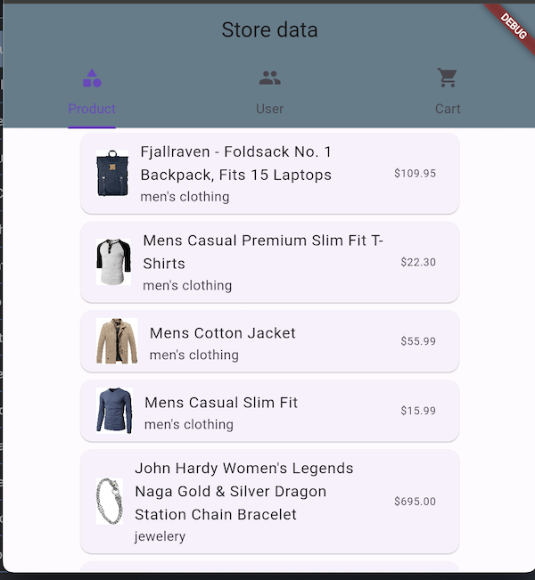

# example

Este ejemplo demuestra el uso del paquete Apistoreapi el cual se conecta al repositorio [Fake Store](https://fakestoreapi.com/)

## Getting Started

Para usar este ejemplo se debe clonar el repositorio de github en: [REpositorio](https://github.com/Javierenrique00/retoflutter_fase3)

Para esto desde una consola se debe ejecutar:

`git clone https://github.com/Javierenrique00/retoflutter_fase3.git`

Ahora se entra al directorio así:

`cd retoflutter_fase3/apistorepackage`

Ahora se puede ajecutar el proyecto de flutter normalmente sobre esta ruta donde podremos ver el ejemplo funcionando con las siguiente pantalla:

